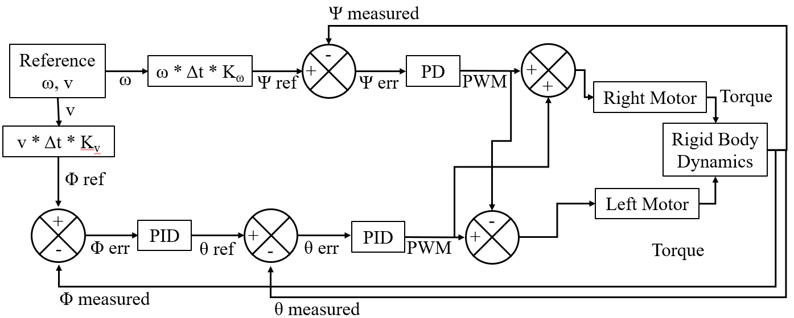
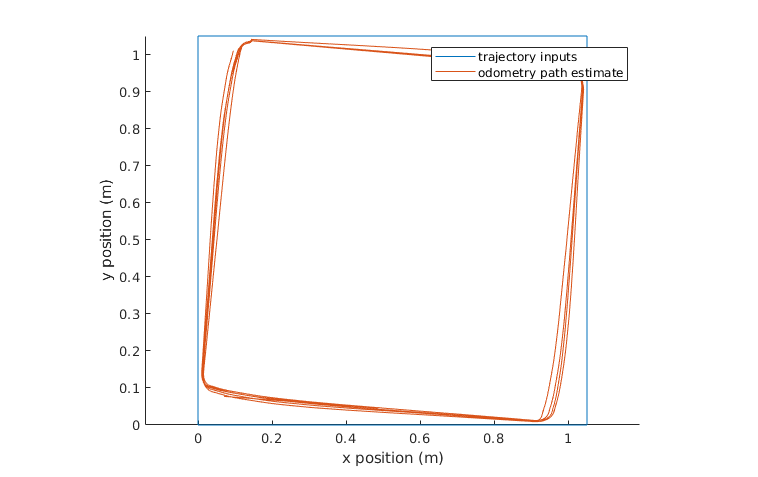

# Balance Bot

For this project, I implemented a cascaded PID controller to stabilize an inverted pendulum style robot. A functional block diagram of the controller is shown below:



The user gives a desired velocity and/or rate of rotation with a remote controller. This reference input is integrated over time to give a reference position to the outer PID loop, which itself generates a reference body angle for the robot to acheive. This allows the robot to oscillate about an equilibrium point. The backlash present in the gearboxes used meant that the robot would not attain a perfectly stationary position.


All of the code for controlling the robot was written in C, and compiled and run on a BeagleBone Green board. Our team of three each developed on independent branches, and merged to master after verifying the code's performance on the robot. The [program](balancebot/balancebot.c) ran in a single thread, driven by interrupts from the IMU's accelerometer at 100 Hz. All necessary state information was passed by a reference to a state data structure:

```c
struct mb_state{
    // raw sensor inputs
    float  theta;         // body angle (rad)
    float  phi;           // average wheel angle (rad)
	double heading;
	double last_heading;
    double left_pos;      // left encoder counts since last reading
    double right_pos;     // right encoder counts since last reading
	double last_pos;

	//calcs 
	float innerloopintegral;
	float outerloopintegral;
	float headingintegral;
	float headingDeltaPWM;
    float headingError;
	float theta_ref;
    float target_x;
    float target_y;
    int cur_target_idx;
    float dist_to_target;

    //outputs
    double   left_cmd;  //left wheel command [-1..1]
    double   right_cmd; //right wheel command [-1..1]

    //references
    float distance_ref;
    float psi_ref;
};
```
The robot was also able to successfully follow a series of waypoint coordinates, moving from one to the next when it had reached a distance threshold of 5 cm. The plot below shows the robot's own trajectory estimate, found from wheel odometry, as it completed four laps around a square.


